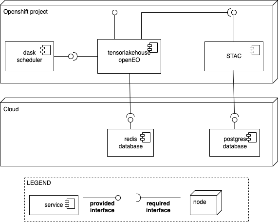
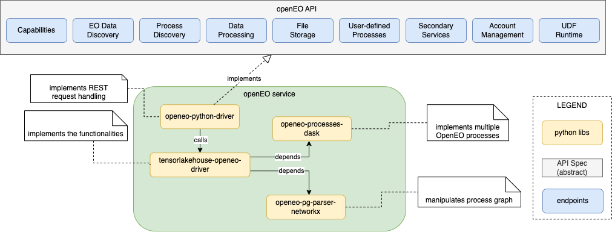
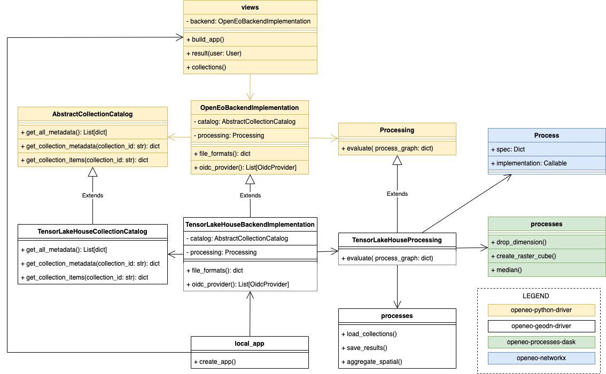

# Software architecture overview

The figure below provides an overview of the tensorlakehouse software architecture. Besides openEO service, the software architecture is composed by a STAC service and a dask scheduler, which runs compute intensive tasks. The STAC service queries a postgres database (which stores STAC entries) and tensorlakehouse-openEO service queries redis database that supports batch jobs. tensorlakehouse-openEO, STAC and dask scheduler are deployed on Openshift/Kubernetes and postgres and redis databases are deployed on cloud. 

 Role of openEO libs on the tensorlakehouse-openEO implementation:
- [openeo-python-driver](https://github.com/Open-EO/openeo-python-driver) is an open-source lib that implements openEO API specification, but it implements only the part the handles the HTTP requests, that is, all functionalities are dummy or hardcoded.  We've implemented a set of python classes and modules that inherits existing openeo-python-driver classes in order to actually implement the functionalities. When we run our service it instantiates our classes, thus when it receives a request, the openeo-python-driver modules calls our classes and not the dummy ones. We reuse openeo-python-driver as-is, but it was necessary to implement the subclasses that actually implements the functionalities.
- [openeo-process-dask](https://github.com/Open-EO/openeo-processes-dask) is another open-source lib that implements multiple openeo processes in a way that is compatible with dask. tensorlakehouse-openEO only implements also implements some processes. 
- [openeo-pg-parser-networkx](https://github.com/Open-EO/openeo-pg-parser-networkx) lib handles the process graph and it is a dependency of openeo-process-dask. -->

## Integration with openeo-python-driver

openeo-python-driver provides superclasses that can be extended to implement a given functionality. For instance, we implemented *TensorLakeHouseCollectionCatalog* which extends *AbstractCollectionCatalog* and passed it as a parameter during the webserver instantiation. When *views* module receives a request to list collections, for example, it calls *TensorLakeHouseCollectionCatalog*.  

## Technical Decisions

According to OpenEO developers "load_collection is meant for "internal" loading from Collections that you have control over and know how they look like. Thus we assume that you know how to load them.
The proposed dimension names are documented at https://api.openeo.org/#tag/EO-Data-Discovery/operation/describe-collection (property: cube:dimension)."

Based on previous discussion, our understanding is that dimension labels should be defined during the generation of STAC entries, that is, when a STAC item is defined it sets dimension labels as documented by STAC datacube extension. If there is a conflict between STAC entries and actual data, then openEO should rename dimension labels to be consitent with STAC entries.

## Handling Non-standard Calendar 

tensorlakehouse automatically convert dates from a 360-day calendar to a standard calendar using [convert_calendar function](https://docs.xarray.dev/en/stable/generated/xarray.DataArray.convert_calendar.html)

> The dates are translated according to their relative position in the year, ignoring their original month and day information, meaning that the missing/surplus days are added/removed at regular intervals. From a 360_day to a standard calendar, the output will be missing the following dates (day of year in parentheses):
> 
>  To a leap year:
>    January 31st (31), March 31st (91), June 1st (153), July 31st (213), September 31st (275) and November 30th (335).
> 
> To a non-leap year: February 6th (36), April 19th (109), July 2nd (183), September 12th (255), November 25th (329).
